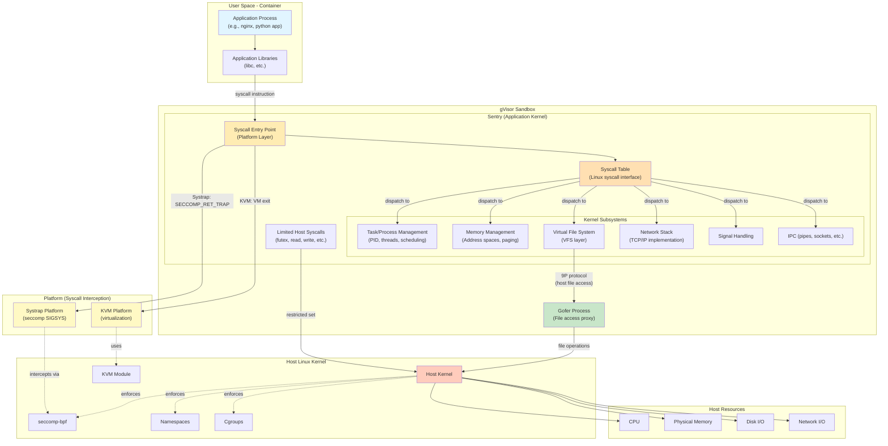

# gVisor Architecture: Top-Down Flow



## Detailed Flow Explanation

### 1. **Application Layer** (Top Level)
- User applications run normally, making standard libc calls
- Applications are unaware they're in a sandbox
- Examples: web servers, databases, Python/Node.js apps

### 2. **Syscall Interception** (Platform Layer)
When the application makes a system call:

**Systrap Platform** (default):
```
Application → syscall instruction → seccomp SECCOMP_RET_TRAP 
→ SIGSYS signal → Sentry takes control
```

**KVM Platform** (bare metal):
```
Application → syscall instruction → VM exit 
→ Sentry (acting as VMM) takes control
```

### 3. **Sentry: Application Kernel** (Core gVisor)
The Sentry implements Linux kernel functionality in Go:

#### a. Syscall Table
- Maps syscall numbers to handler functions
- Linux-compatible interface (same syscall numbers as Linux)
- Different tables for amd64/arm64

#### b. Kernel Subsystems (Reimplemented in Go)
- **Task Management**: Process/thread tracking, scheduling, fork/exec
- **Memory Management**: Virtual memory, page tables, demand paging
- **VFS**: File system abstraction, overlayfs, tmpfs, etc.
- **Network Stack**: Full TCP/IP stack from scratch (gvisor.dev/gvisor/pkg/tcpip)
- **Signal Handling**: Signal delivery, handlers, masks
- **IPC**: Pipes, Unix sockets, shared memory

### 4. **Two Execution Paths**

**Path A: Pure Sentry Handling** (Most Common)
```
getpid() → Sentry's PID table → Return PID
read(pipe) → Sentry's pipe buffer → Return data
TCP send() → Sentry's network stack → Packet processing
```
*No host syscalls made!*

**Path B: Requires Host Resources**
```
read(file on host) → VFS → 9P to Gofer → Gofer reads → Return data
futex() for Go runtime → Sentry → Host futex syscall
```

### 5. **Gofer Process** (Privileged Sidecar)
- Runs in separate process with more privileges
- Handles host filesystem access via 9P protocol
- Allows Sentry to remain restricted
- Communication via Unix domain sockets

### 6. **Host Syscall Boundary** (Security Layer)
Sentry makes **very limited** host syscalls:
- ✅ Allowed: `futex`, `read`, `write`, `mmap`, `munmap`
- ❌ Blocked: `exec`, `connect`, `socket`, `open`, most others
- Enforced by seccomp-bpf filter
- Additional isolation: namespaces, cgroups, no capabilities

### 7. **Host Linux Kernel**
- Sees Sentry as normal userspace process
- Enforces security restrictions
- Manages actual hardware resources

### 8. **Physical Resources**
- CPU: Dynamic allocation (not pre-reserved like VMs)
- Memory: Backed by single memfd, demand-paged
- I/O: Through Gofer or Sentry's limited syscalls

## Example: `read()` Syscall Flow

### Scenario 1: Reading from a pipe
```
┌─────────────────────────────────────────────────┐
│ 1. App calls read(pipe_fd, buf, size)          │
└─────────────────┬───────────────────────────────┘
                  │
                  ▼
┌─────────────────────────────────────────────────┐
│ 2. Systrap: seccomp intercepts syscall         │
│    SIGSYS delivered to Sentry                   │
└─────────────────┬───────────────────────────────┘
                  │
                  ▼
┌─────────────────────────────────────────────────┐
│ 3. Sentry Syscall Table                         │
│    Looks up syscall #0 (read) → read handler   │
└─────────────────┬───────────────────────────────┘
                  │
                  ▼
┌─────────────────────────────────────────────────┐
│ 4. VFS Layer checks FD                          │
│    FD is a pipe (in-sandbox resource)           │
└─────────────────┬───────────────────────────────┘
                  │
                  ▼
┌─────────────────────────────────────────────────┐
│ 5. Pipe Implementation (in Sentry memory)       │
│    Copies data from pipe buffer to app buffer   │
│    May use host futex for blocking              │
└─────────────────┬───────────────────────────────┘
                  │
                  ▼
┌─────────────────────────────────────────────────┐
│ 6. Return to application                        │
│    No host read() syscall was made!             │
└─────────────────────────────────────────────────┘
```

### Scenario 2: Reading from a host file
```
┌─────────────────────────────────────────────────┐
│ 1. App calls read(file_fd, buf, size)          │
└─────────────────┬───────────────────────────────┘
                  │
                  ▼
┌─────────────────────────────────────────────────┐
│ 2. Systrap intercepts → Sentry                  │
└─────────────────┬───────────────────────────────┘
                  │
                  ▼
┌─────────────────────────────────────────────────┐
│ 3. Syscall Table → read handler                 │
└─────────────────┬───────────────────────────────┘
                  │
                  ▼
┌─────────────────────────────────────────────────┐
│ 4. VFS: FD is host-backed file                  │
└─────────────────┬───────────────────────────────┘
                  │
                  ▼
┌─────────────────────────────────────────────────┐
│ 5. 9P RPC to Gofer                              │
│    "Read from FD X, offset Y, size Z"           │
└─────────────────┬───────────────────────────────┘
                  │
                  ▼
┌─────────────────────────────────────────────────┐
│ 6. Gofer: read() host syscall                   │
│    (Gofer has file descriptor from SCM_RIGHTS)  │
└─────────────────┬───────────────────────────────┘
                  │
                  ▼
┌─────────────────────────────────────────────────┐
│ 7. Host kernel performs actual disk read        │
└─────────────────┬───────────────────────────────┘
                  │
                  ▼
┌─────────────────────────────────────────────────┐
│ 8. Data flows: Host → Gofer → Sentry → App     │
└─────────────────────────────────────────────────┘
```

## Key Security Properties

1. **Defense in Depth**: Sandboxed app → Sentry (Go, memory-safe) → Host kernel
2. **Minimal Host Surface**: Sentry uses ~70 syscalls vs ~300+ Linux syscalls
3. **No Direct Passthrough**: Every syscall is handled by Sentry logic
4. **Process Isolation**: Sentry runs in restricted namespace/seccomp jail
5. **Resource Flexibility**: Unlike VMs, dynamic CPU/memory allocation

## Components Summary

| Component | Language | Role | Trust Level |
|-----------|----------|------|-------------|
| Application | Any | User workload | Untrusted |
| Sentry | Go | Application kernel | Sandbox boundary |
| Gofer | Go | File proxy | More privileged |
| Platform | Go | Syscall interception | Part of Sentry |
| Host Kernel | C | Resource management | Trusted |

## File Locations in Codebase

- **runsc**: `/runsc/` - OCI runtime entry point
- **Sentry**: `/pkg/sentry/` - Application kernel
- **Syscall tables**: `/pkg/sentry/syscalls/linux/`
- **Platform**: `/pkg/sentry/platform/systrap/`, `/pkg/sentry/platform/kvm/`
- **Network stack**: `/pkg/tcpip/`
- **VFS**: `/pkg/sentry/vfs/`
- **Gofer**: `/runsc/fsgofer/`
